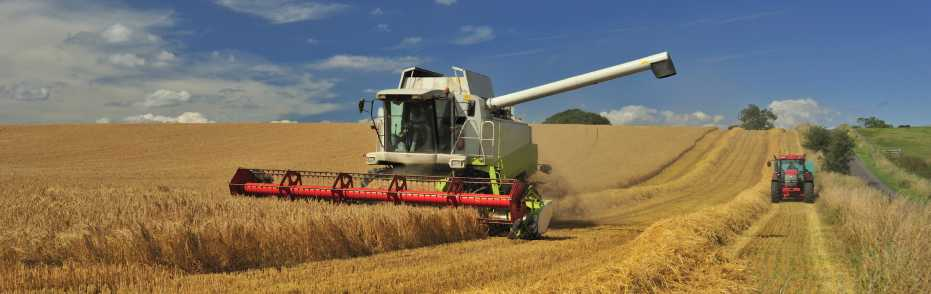
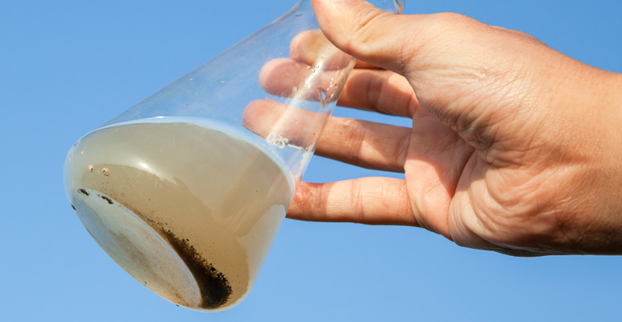
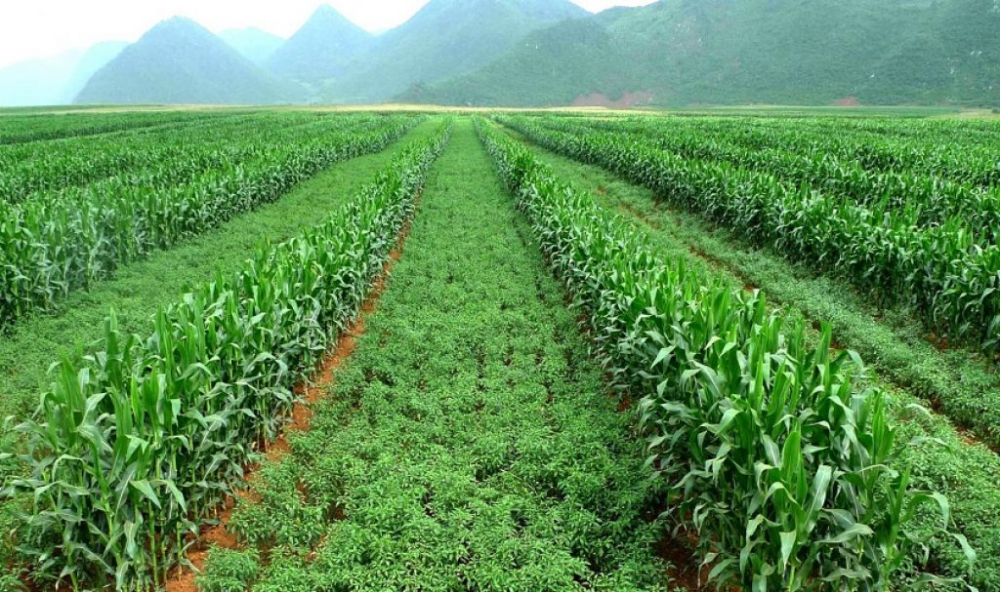

Αυτόνομο Ρομποτικό Όχημα Αγρότης (Α.Ρ.Ο.Α.)
--------
Ένα αυτόματο ρομποτικό όχημα για την χαρτογράφηση του εδάφους στο χωράφι και για βοηθητικές εργασίες.
***

**Σύνδεση με το πρόγραμμα σπουδών στο Δημοτικό.**

Σύμφωνα με τις οδηγίες διδασκαλίας και τη διδακτέα ύλη Δημοτικού Σχολείου για το διδακτικό μαθησιακό αντικείμενο  «Τεχνολογίες Πληροφορίας και Επικοινωνιών» (Αρ. Πρωτοκόλλου: Φ20/1835/222136/Δ1) στην Ε' και Στ'  Τάξη προβλέπεται η ενότητα «Υλοποιώ σχέδια εργασίας/έρευνας (project) με τις ΤΠΕ» με ενδεικτικό διδακτικό χρόνο 8 ώρες. Μέσα στις προτεινόμενες δραστηριότητες υπάρχει καταγεγραμμένη και η θεματική ενότητα Εκπαιδευτική Ρομποτική στην οποία προτείνουμε την εφαρμογή του παρόντος project.
***

**To πρόβλημα**

Το έδαφος αποτελεί τον πλουσιότερο πόρο για την γεωργία και οι αγρότες προσπαθούν να το εκμεταλλευτούν όσο καλύτερα γίνεται. Όμως οι βαριές θεριστικές μηχανές βλάπτουν το έδαφος συμπιέζοντας το, επιπλέον, η υπερβολική χρήση χημικών ουσιών στην γεωργία, όπως τα αζωτούχα λιπάσματα, αποτελούν αρνητικούς παράγοντες μολύνοντας το περιβάλλον αλλά και επιβαρύνοντας την υγεία των αγροτών. Η ρομποτική και οι αυτόνομες μηχανές μπορούν να βοηθήσουν στην επίλυση αυτών των προβλημάτων.

Με τη χρήση του ΑΡΟΑ  μπορεί να χαρτογραφηθεί η βιομάζα του χωραφιού και να πραγματοποιηθούν, όπου χρειάζονται, παρεμβάσεις π.χ. στοχευμένη λίπανση. Έτσι θα γίνεται πιο οικονομική χρήση λιπασμάτων εξοικονομώντας χρήματα για τον αγρότη αλλά και μειώνοντας την επιβάρυνση του περιβάλλοντος από αυτά. Επιπλέον, το ΑΡΟΑ μπορεί να μετρήσει άλλους δείκτες ποιότητας εδάφους χρησιμοποιώντας διάφορους αισθητήρες  μπορεί να πάρει ένα δείγμα εδάφους, να το ρευστοποιήσει και να το αναλύσει για να χαρτογραφήσει με ακρίβεια σε πραγματικό χρόνο χαρακτηριστικά όπως το pH και τα επίπεδα φωσφόρου και την ηλεκτρική αγωγιμότητα του εδάφους.

Η χαρτογράφηση του εδάφους είναι ιδιαίτερα σημαντική. Είναι γεγονός πως η φύση είναι ενάντια στην μονοκαλλιέργεια, η οποία είναι ένας λόγος που πρέπει να χρησιμοποιήσουμε τεράστιες ποσότητες ζιζανιοκτόνων και φυτοφαρμάκων. Η καλλιέργεια πολλαπλών καλλιεργειών μαζί αφορά στην ουσία την καλύτερη δυνατή χρήση των πόρων. Αναλόγως των εδαφικών ιδιοτήτων σε κάθε διαφορετικό σημείο του χωραφιού μπορεί να γίνει  και η ανάλογη σπορά και φύτευση διαφορετικών ποικιλιών καλλιεργειών. Έτσι για παράδειγμα στο ίδιο χωράφι  μπορεί να καλλιεργηθεί  με επιτυχία, τόσο σιτάρι όσο και κριθάρι!

Το ΑΡΟΑ μπορεί  να κάνει πραγματικότητα  τη μικτή φύτευση προστατεύοντας  το έδαφος και προσφέροντας σημαντικό οικονομικό όφελος με τις ελάχιστες επιπτώσεις στο περιβάλλον και στη ανθρώπινη υγεία.

***

**Περισσότερες πληροφορίες**

 [Υλικά για την κατασκευή του ΑΡΟΑ](hardware.md)
 
